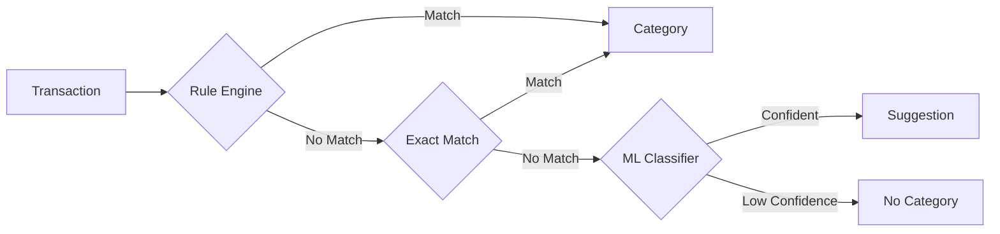

# Smart Categorization Engine - Implementation Walkthrough

## Overview

A robust transaction categorization system for Moony Finance App using a waterfall approach:



---

## Files Created

### Core Modules

| File | Purpose | Tests |
|------|---------|-------|
| [mod.rs](file:///Users/filipkral/Documents/Programování/FinanceApp/Moony-tauri/src-tauri/src/services/categorization/mod.rs) | Module exports and re-exports | - |
| [types.rs](file:///Users/filipkral/Documents/Programování/FinanceApp/Moony-tauri/src-tauri/src/services/categorization/types.rs) | Core types: `CategorizationResult`, `RuleType`, [TransactionInput](file:///Users/filipkral/Documents/Programov%C3%A1n%C3%AD/FinanceApp/Moony-tauri/src-tauri/src/services/categorization/types.rs#59-73) | 3 |
| [tokenizer.rs](file:///Users/filipkral/Documents/Programování/FinanceApp/Moony-tauri/src-tauri/src/services/categorization/tokenizer.rs) | Czech text normalization, diacritics stripping, stopwords | 8 |
| [rules.rs](file:///Users/filipkral/Documents/Programování/FinanceApp/Moony-tauri/src-tauri/src/services/categorization/rules.rs) | Pattern-based rule engine (regex, contains, symbols) | 6 |
| [exact_match.rs](file:///Users/filipkral/Documents/Programování/FinanceApp/Moony-tauri/src-tauri/src/services/categorization/exact_match.rs) | HashMap-based payee lookup | 8 |
| [ml_classifier.rs](file:///Users/filipkral/Documents/Programování/FinanceApp/Moony-tauri/src-tauri/src/services/categorization/ml_classifier.rs) | Naive Bayes classifier with bincode persistence | 5 |
| [engine.rs](file:///Users/filipkral/Documents/Programování/FinanceApp/Moony-tauri/src-tauri/src/services/categorization/engine.rs) | Master orchestrator with thread-safe access | 7 |
| [default_rules.rs](file:///Users/filipkral/Documents/Programování/FinanceApp/Moony-tauri/src-tauri/src/services/categorization/default_rules.rs) | 80+ Czech banking rules | 3 |
| [training_data.rs](file:///Users/filipkral/Documents/Programování/FinanceApp/Moony-tauri/src-tauri/src/services/categorization/training_data.rs) | Synthetic dataset generator (~1,500+ samples) | 1 |
| [fio_scraper.rs](file:///Users/filipkral/Documents/Programování/FinanceApp/Moony-tauri/src-tauri/src/services/categorization/fio_scraper.rs) | Fio transparent account API client | 1 |

### Command Layer

| File | Purpose |
|------|---------|
| [categorization.rs](file:///Users/filipkral/Documents/Programování/FinanceApp/Moony-tauri/src-tauri/src/commands/categorization.rs) | Tauri IPC handlers for frontend integration |

---

## Key Features

### 1. Czech Text Normalization

```rust
// Input: "Příchozí platba VS:123456 Albert"
let (normalized, symbols) = normalize_czech(text);
// Output: "albert"  (stopwords removed, diacritics stripped)
// symbols.variable_symbol = Some("123456")
```

**Features:**
- Diacritics stripping (ř → r, ě → e)
- 50+ Czech stopwords removed
- Symbol extraction (VS, SS, KS)
- Long number replacement with `<NUM>` token
- N-gram generation for ML features

### 2. Rule Engine

Supports multiple rule types with priority-based execution:

```rust
pub enum RuleType {
    Regex,           // Full regex matching
    Contains,        // Case-insensitive substring
    StartsWith,      // Position-based
    EndsWith,        // Position-based
    VariableSymbol,  // Czech payment symbol
    ConstantSymbol,  // Czech payment symbol
    SpecificSymbol,  // Czech payment symbol
}
```

### 3. Machine Learning Classifier

Custom Multinomial Naive Bayes implementation:

- **Vocabulary**: Up to 5,000 terms, min 2 document frequency
- **Features**: Term frequency with n-grams (unigrams + bigrams)
- **Serialization**: bincode for efficient model persistence
- **Confidence**: Softmax probabilities with configurable threshold

### 4. Default Rules (80+)

Pre-configured rules covering Czech merchants:

| Category | Examples |
|----------|----------|
| Groceries | Albert, Billa, Lidl, Kaufland, Tesco, Rohlik |
| Dining | Uber Eats, Wolt, McDonald's, Starbucks |
| Transport | DPP, České dráhy, RegioJet, Uber, Bolt |
| Utilities | ČEZ, PRE, T-Mobile, O2, Vodafone |
| Entertainment | Netflix, Spotify, Steam, Cinema City |
| Shopping | Alza, Amazon, Zara, IKEA, dm drogerie |
| Health | Dr.Max, BENU, lékárny, fitness |
| Travel | Ryanair, Wizz Air, Booking.com, Airbnb |
| Income | Salary patterns, refunds, ČSSZ |
| Transfers | Bank transfers, ATM, savings |

---

## API Reference

### Tauri Commands

```typescript
// Categorize single transaction
const result = await invoke('categorize_transaction', {
  transaction: {
    id: 'tx1',
    description: 'Platba kartou Albert Praha',
    counterparty: 'Albert CZ',
    amount: -523.0,
    isCredit: false
  }
});

// Learn from user correction
await invoke('learn_categorization', {
  payee: 'Uber Eats',
  categoryId: 'cat_dining'
});

// Get engine stats
const stats = await invoke('get_categorization_stats');
// { activeRules: 80, learnedPayees: 5, mlClasses: 10, mlVocabularySize: 1234 }

// Retrain ML model
await invoke('retrain_ml_model', {
  samples: [
    { text: 'Albert Praha nakup', categoryId: 'cat_groceries' },
    { text: 'Uber Eats Praha', categoryId: 'cat_dining' }
  ]
});
```

### Result Types

```typescript
type CategorizationResult = 
  | { type: 'Match', data: { categoryId: string, source: CategorizationSource } }
  | { type: 'Suggestion', data: { categoryId: string, confidence: number } }
  | { type: 'None' };

type CategorizationSource =
  | { type: 'Rule', data: { ruleId: string, ruleName: string } }
  | { type: 'ExactMatch', data: { payee: string } }
  | { type: 'MachineLearning', data: { confidence: number } }
  | { type: 'Manual' };
```

---

## Training Data

### Synthetic Dataset

The [training_data.rs](file:///Users/filipkral/Documents/Programování/FinanceApp/Moony-tauri/src-tauri/src/services/categorization/training_data.rs) module generates ~1,500+ samples:

```rust
let training_samples = generate_training_data();
// Returns Vec<(description, category_id)>
```

**Category Distribution:**

| Category | Approx. Samples |
|----------|-----------------|
| Groceries | ~200 |
| Dining | ~150 |
| Transport | ~180 |
| Utilities | ~200 |
| Entertainment | ~150 |
| Shopping | ~250 |
| Health | ~120 |
| Travel | ~150 |
| Income | ~80 |
| Transfers | ~60 |

### Training Guide

See [training_guide.md](file:///Users/filipkral/.gemini/antigravity/brain/ac9d451c-2297-4a7c-b001-257be8c80587/training_guide.md) for:
- Incremental learning from user corrections
- Bulk retraining procedures
- Model export/import
- Fio transparent account data fetching

---

## Testing Results

```
test result: ok. 69 passed; 0 failed; 1 ignored
Doc-tests: 2 passed
Clippy: clean (0 warnings)
```

---

## Dependencies Added

```toml
# Cargo.toml additions
smartcore = { version = "0.4", features = ["serde"] }
unicode-normalization = "0.1"
bincode = "1.3"
```

---

## Files Modified

| File | Changes |
|------|---------|
| [Cargo.toml](file:///Users/filipkral/Documents/Programování/FinanceApp/Moony-tauri/src-tauri/Cargo.toml) | Added smartcore, unicode-normalization, bincode |
| [services/mod.rs](file:///Users/filipkral/Documents/Programování/FinanceApp/Moony-tauri/src-tauri/src/services/mod.rs) | Registered categorization module |
| [commands/mod.rs](file:///Users/filipkral/Documents/Programování/FinanceApp/Moony-tauri/src-tauri/src/commands/mod.rs) | Registered categorization commands |
| [lib.rs](file:///Users/filipkral/Documents/Programování/FinanceApp/Moony-tauri/src-tauri/src/lib.rs) | Added CategorizationState + 10 command handlers |

---

## Next Steps (Optional)

1. **Database Migration**: Add [learned_payees](file:///Users/filipkral/Documents/Programov%C3%A1n%C3%AD/FinanceApp/Moony-tauri/src-tauri/src/commands/categorization.rs#119-126) table for persistence
2. **Frontend Integration**: Create React components for categorization UI
3. **Auto-categorize on Import**: Hook into CSV import flow
4. **Rule Editor**: UI for managing custom rules
5. **Model Persistence**: Save trained model to app data directory
