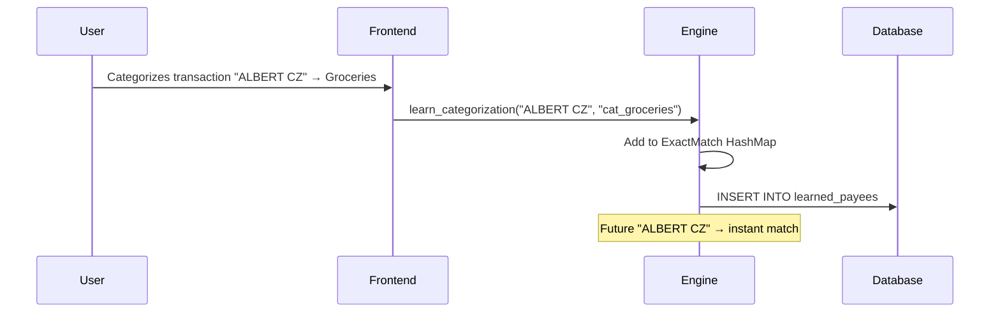

# ML Categorization Model Training Guide

This guide explains how to train, improve, and maintain the Smart Categorization Engine's machine learning model for bank transaction classification.

---

## Table of Contents

1. [Initial Training](#initial-training)
2. [Incremental Learning](#incremental-learning)
3. [Bulk Retraining](#bulk-retraining)
4. [Using Fio Transparent Accounts](#using-fio-transparent-accounts)
5. [Model Export & Import](#model-export--import)
6. [Best Practices](#best-practices)
7. [Troubleshooting](#troubleshooting)

---

## Initial Training

The app ships with a pre-trained model based on synthetic Czech banking data. This model is automatically loaded on first launch.

### Synthetic Training Data Sources

The base model is trained on ~1,500+ samples covering:

| Category | Sample Count | Examples |
|----------|--------------|----------|
| Groceries | ~200 | Albert, Billa, Lidl, Kaufland, Tesco, Penny, Rohlik |
| Dining | ~150 | Uber Eats, Wolt, McDonald's, restaurant chains |
| Transport | ~180 | DPP, České dráhy, Bolt, Uber, fuel stations |
| Utilities | ~200 | ČEZ, PRE, T-Mobile, O2, rent payments |
| Entertainment | ~150 | Netflix, Spotify, Steam, cinemas |
| Shopping | ~250 | Alza, Amazon, Zara, H&M, IKEA, dm drogerie |
| Health | ~120 | Dr.Max, lékárny, doctors, fitness |
| Travel | ~150 | Airlines, Booking.com, hotels |
| Income | ~80 | Salary, benefits, refunds |
| Transfers | ~60 | Bank transfers, ATM, savings |

### Running Initial Training

```rust
use crate::services::categorization::{
    ml_classifier::MLClassifier,
    training_data::generate_training_data,
    tokenizer::normalize_czech,
};

// Generate synthetic training data
let training_samples = generate_training_data();

// Create and train classifier
let mut classifier = MLClassifier::new();
classifier.train(training_samples)?;

// Save trained model
classifier.save_model(Path::new("resources/base_model.bin"))?;
```

---

## Incremental Learning

The most effective way to improve the model is by learning from user corrections. When a user manually categorizes a transaction, the system:

1. **Adds to Exact Match HashMap** - Immediate effect for identical payees
2. **Stores for Retraining** - Collected for periodic model updates

### How User Learning Works



### Triggering Learning via API

```typescript
// Frontend: After user manually categorizes
await invoke('learn_categorization', {
  payee: transaction.counterpartyName,
  categoryId: selectedCategory.id,
  transactionId: transaction.id
});
```

### Learning from Bulk Import

When importing transactions with a CSV that includes categories:

```rust
// After CSV import with category column
for tx in imported_transactions {
    if let Some(category_id) = tx.category_id {
        engine.learn_from_user(&tx.counterparty, &category_id);
    }
}
```

---

## Bulk Retraining

Periodically retrain the model with accumulated user data for better personalization.

### When to Retrain

- After 100+ manual categorizations
- Monthly for active users
- When accuracy drops noticeably

### Retraining Process

```rust
use rusqlite::Connection;

// 1. Collect training samples from database
fn collect_training_samples(conn: &Connection) -> Vec<(String, String)> {
    let mut stmt = conn.prepare(r#"
        SELECT 
            COALESCE(t.description, '') || ' ' || COALESCE(t.counterparty_name, ''),
            t.category_id
        FROM bank_transactions t
        WHERE t.category_id IS NOT NULL
          AND t.categorization_source = 'manual'  -- Only manually verified
        UNION ALL
        SELECT 
            original_payee,
            category_id
        FROM learned_payees
    "#).unwrap();
    
    stmt.query_map([], |row| {
        Ok((row.get::<_, String>(0)?, row.get::<_, String>(1)?))
    })
    .unwrap()
    .filter_map(|r| r.ok())
    .collect()
}

// 2. Combine with base training data
let base_samples = generate_training_data();
let user_samples = collect_training_samples(&conn);

// User samples get higher weight (duplicate them)
let mut all_samples = base_samples;
for sample in user_samples {
    all_samples.push(sample.clone());
    all_samples.push(sample.clone());  // 2x weight
    all_samples.push(sample);           // 3x weight
}

// 3. Retrain
classifier.train(all_samples)?;

// 4. Save new model
classifier.save_model(Path::new("user_model.bin"))?;
```

### Automatic Scheduled Retraining

```rust
// In app startup or background task
let needs_retrain = {
    let last_retrain: i64 = get_setting(&conn, "last_model_retrain")?
        .parse()
        .unwrap_or(0);
    let manual_count: i64 = conn.query_row(
        "SELECT COUNT(*) FROM bank_transactions WHERE categorization_source = 'manual'",
        [],
        |row| row.get(0),
    )?;
    
    let days_since = (chrono::Utc::now().timestamp() - last_retrain) / 86400;
    
    days_since > 30 || manual_count > 100
};

if needs_retrain {
    retrain_model(&conn, &engine)?;
    set_setting(&conn, "last_model_retrain", &chrono::Utc::now().timestamp().to_string())?;
}
```

---

## Using Fio Transparent Accounts

Augment training data with real transactions from Fio transparent accounts (publicly available).

> [!NOTE]
> Transparent accounts are designed to be publicly visible. This only accesses data that account owners have intentionally made public.

### Finding Transparent Accounts

1. Visit [ib.fio.cz/ib/transparent](https://ib.fio.cz/ib/transparent)
2. Search for organizations (political parties, nonprofits, etc.)
3. Note the account numbers you want to use

### Fetching Data

```rust
use crate::services::categorization::fio_scraper::*;

async fn fetch_fio_training_data(account_numbers: &[&str]) -> Result<Vec<(String, String)>> {
    let client = reqwest::Client::new();
    let mut all_samples = Vec::new();
    
    for account in account_numbers {
        // Fetch last 2 years of data
        for year in [2024, 2025] {
            match fetch_transparent_account(&client, account, year).await {
                Ok(statement) => {
                    if let Some(tx_list) = statement.account_statement.transaction_list {
                        if let Some(transactions) = tx_list.transaction {
                            // You need to manually categorize these or use heuristics
                            for tx in transactions {
                                // Example: Extract counterparty for groceries detection
                                if let Some(name) = tx.columns.get("column10").and_then(|c| c.as_string()) {
                                    if name.to_lowercase().contains("albert") {
                                        all_samples.push((name, "cat_groceries".to_string()));
                                    }
                                }
                            }
                        }
                    }
                }
                Err(e) => {
                    eprintln!("Failed to fetch {}: {}", account, e);
                }
            }
        }
    }
    
    Ok(all_samples)
}
```

### Semi-Automatic Labeling

Use the rule engine to pre-label Fio data:

```rust
fn label_with_rules(
    transactions: &[FioTransactionWrapper],
    rule_engine: &RuleEngine,
) -> Vec<(String, String)> {
    let mut labeled = Vec::new();
    
    for tx in transactions {
        let description = extract_description(tx);
        let input = TransactionInput {
            id: "temp".into(),
            description: Some(description.clone()),
            counterparty: None,
            variable_symbol: None,
            constant_symbol: None,
            specific_symbol: None,
            amount: 0.0,
            is_credit: false,
        };
        
        if let Some((result, _)) = rule_engine.apply(&input) {
            if let CategorizationResult::Match { category_id, .. } = result {
                labeled.push((description, category_id));
            }
        }
    }
    
    labeled
}
```

---

## Model Export & Import

### Exporting for Backup

```rust
// Export current model
let export_path = format!("backup/model_{}.bin", chrono::Local::now().format("%Y%m%d"));
engine.save_ml_model(Path::new(&export_path))?;
```

### Importing a Model

```rust
// Load custom model
let classifier = MLClassifier::load_model(Path::new("custom_model.bin"))?;
```

### Sharing Models

Models can be shared between users with similar transaction patterns:

```rust
// User A exports
classifier.save_model(Path::new("shared_czech_model.bin"))?;

// User B imports
let shared_classifier = MLClassifier::load_model(Path::new("shared_czech_model.bin"))?;
```

---

## Best Practices

### 1. Prioritize User Corrections

User-labeled data is more valuable than synthetic data. Weight it higher:

```rust
// User samples get 3x weight
for sample in user_samples {
    training_data.push(sample.clone());
    training_data.push(sample.clone());
    training_data.push(sample);
}
```

### 2. Balance Categories

Ensure each category has sufficient samples (minimum 50 recommended):

```rust
fn balance_training_data(samples: &mut Vec<(String, String)>) {
    let mut counts: HashMap<String, usize> = HashMap::new();
    for (_, cat) in samples.iter() {
        *counts.entry(cat.clone()).or_insert(0) += 1;
    }
    
    let max_count = *counts.values().max().unwrap_or(&0);
    
    // Oversample minority categories
    let mut additional = Vec::new();
    for (text, cat) in samples.iter() {
        let count = counts.get(cat).unwrap_or(&0);
        let copies = (max_count / count).min(3);
        for _ in 0..copies {
            additional.push((text.clone(), cat.clone()));
        }
    }
    
    samples.extend(additional);
}
```

### 3. Use Distinctive Features

The tokenizer extracts useful features:

- **N-grams**: "albert hypermarket" becomes ["albert", "hypermarket", "albert_hypermarket"]
- **Symbol Extraction**: VS/SS/KS are extracted separately
- **Diacritics Removed**: "Příchozí" → "prichozi"

### 4. Monitor Accuracy

Track categorization accuracy over time:

```sql
-- Accuracy tracking query
SELECT 
    strftime('%Y-%m', datetime(created_at, 'unixepoch')) as month,
    COUNT(*) as total,
    SUM(CASE WHEN categorization_source != 'manual' THEN 1 ELSE 0 END) as auto_categorized,
    SUM(CASE WHEN categorization_source = 'manual' THEN 1 ELSE 0 END) as manual_corrections
FROM bank_transactions
WHERE category_id IS NOT NULL
GROUP BY month
ORDER BY month DESC;
```

### 5. Regular Rules Maintenance

Rules are faster and more reliable than ML for known patterns:

```rust
// Add new rule when pattern is clear
let new_rule = CategorizationRule {
    id: uuid::Uuid::new_v4().to_string(),
    name: "New fitness chain".into(),
    rule_type: RuleType::Contains,
    pattern: "fitinn".into(),
    category_id: "cat_health".into(),
    priority: 50,
    is_active: true,
    stop_processing: false,
};
```

---

## Troubleshooting

### Model Too Large (>10MB)

Reduce vocabulary size:

```rust
vocabulary.fit(&normalized, 3000, 3);  // Max 3000 features, min 3 docs
```

### Poor Accuracy on Specific Category

1. Check sample count for that category
2. Add more specific training examples
3. Consider adding a rule instead

### Model Prediction Very Slow

- Reduce vocabulary size
- Use rule engine for common patterns
- Cache predictions for identical payees

### "Not Enough Samples" Error

Need at least 10 samples with at least 2 unique categories:

```rust
if samples.len() < 10 {
    return Err(anyhow::anyhow!("Need at least 10 samples to train"));
}
```

### Overfitting to User's Transactions

Balance user data with base training data:

```rust
let user_weight = 3;  // Not too high
let base_samples = generate_training_data();
// ... add user samples with moderate weight
```

---

## API Reference

### MLClassifier

```rust
impl MLClassifier {
    /// Create empty classifier
    pub fn new() -> Self;
    
    /// Load from binary file
    pub fn load_model(path: &Path) -> Result<Self>;
    
    /// Save to binary file
    pub fn save_model(&self, path: &Path) -> Result<()>;
    
    /// Train on labeled samples
    pub fn train(&mut self, samples: Vec<(String, String)>) -> Result<()>;
    
    /// Predict category for transaction
    pub fn predict(&self, tx: &TransactionInput, min_confidence: f64) -> Option<CategorizationResult>;
}
```

### Training Data Generator

```rust
/// Generate synthetic training data for Czech banking
pub fn generate_training_data() -> Vec<(String, String)>;

/// Print statistics about training data
pub fn print_statistics(data: &[(String, String)]);
```

---

## Summary

| Method | When to Use | Effort | Impact |
|--------|-------------|--------|--------|
| Synthetic base training | Initial setup | Auto | Medium |
| User correction learning | User categorizes | Auto | High |
| Periodic bulk retraining | Monthly | Schedule | Medium |
| Fio transparent accounts | Need more data | Manual | Low-Medium |
| Rule additions | Clear patterns | Manual | High |
